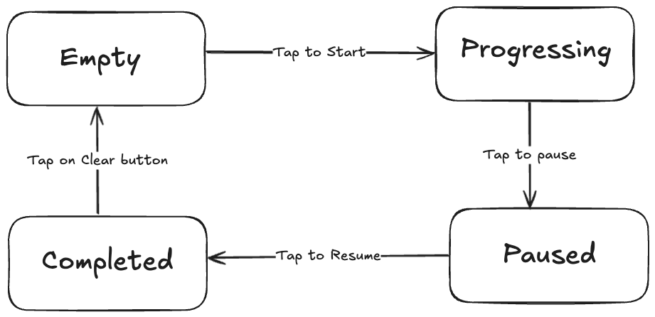

# ❤️ Heart App – Flutter MVVM Architecture

## Overview

**Heart App** is a Flutter application built to demonstrate clean architecture principles using **MVVM (Model-View-ViewModel)**, **Repository Pattern**, and **Dependency Injection (DI)** with `get_it`.

The app displays a heart that fills up from **0% to 100%**.  
Users can tap the heart to **start**, **pause**, or **resume** progress.  
Progress persists between sessions using **SharedPreferences**.

---

## 🧩 Architecture Summary

```
lib/
│
├── app.dart                      → Root MaterialApp (UI entry)
├── main.dart                     → Initializes DI & Provider
│
├── model/                        → Data layer
│   ├── heart.dart                    → Core Heart entity
│   ├── repository/
│   │   ├── heart_repository.dart      → Repository interface
│   │   └── heart_repository_impl.dart → Repository implementation
│   └── services/
│       ├── local_storage.dart         → SharedPreferences wrapper
│       ├── heart_local_driver.dart    → Adapts LocalStorage to Heart model
│       └── heart_fill_service.dart    → Handles periodic fill logic
│
├── viewmodels/
│   └── heart_view_model.dart      → State logic, timers, persistence
│
└── ui/
    ├── screens/
    │   ├── heart_screen.dart      → Main screen (progress, tap logic)
    │   └── success_screen.dart    → Completion screen
    └── widgets/
        ├── heart_painter_twoIcon+ClipRect.dart
        ├── HeartPainterFill.dart
        ├── HeartPathFill_ClipPathHeart.dart
        └── _LiquidHeartChartState.dart
```

---

## 🧠 Design Patterns

### MVVM (Model-View-ViewModel)

- **Model:** Business logic & data (Heart entity, Repository).
- **ViewModel:** Exposes observable state, holds timer and persistence logic.
- **View:** Stateless UI that listens to ViewModel via Provider.

### Repository Pattern

- **`HeartRepository`** defines how to load/save/clear state.
- **`HeartRepositoryImpl`** delegates to a **HeartLocalDriver**, decoupling the ViewModel from data source specifics.

### Dependency Injection (GetIt)

Used to register and resolve services and repositories globally:

```dart
sl.registerLazySingleton<HeartRepository>(() => HeartRepositoryImpl(sl<HeartLocalDriver>()));
sl.registerFactory<HeartViewModel>(() => HeartViewModel(repo: sl(), filler: sl()));
```

---

## ⚙️ State Management

State is handled using **Provider + ChangeNotifier**.

| State                    | Description                      |
| ------------------------ | -------------------------------- |
| `HeartState.empty`       | Initial or cleared.              |
| `HeartState.progressing` | Timer running and heart filling. |
| `HeartState.paused`      | Temporarily paused.              |
| `HeartState.completed`   | Fully filled.                    |

### ViewModel Responsibilities

- Starts/stops a timer every 1 second.
- Increments progress by `capacity * 0.1` (10% per tick).
- Saves state and progress persistently via repository.
- Exposes:
  ```dart
  double get percent => (progress / capacity) * 100;
  HeartState get state;
  ```

---

## 💾 Data Persistence Flow

1. `HeartViewModel` calls `repo.save(heart, stateIndex)`.
2. Repository delegates to `HeartLocalDriver`.
3. Driver uses `LocalStorage` (SharedPreferences) to persist:
   - `progress`
   - `capacity`
   - `stateIndex`
4. On app relaunch, ViewModel loads previous values and resumes.

---

## 🧱 Layered Diagram


---

## 🔄 State Flow



---

## 🎨 UI and UX Design

- The heart can be rendered via **modular visual widgets**:

  - `HeartFillWidget` (Icon + ClipRect)
  - `HeartPainterFill` (CustomPainter)
  - `LiquidHeartChart` (animated fill)
  - `HeartPathFill_ClipPathHeart` (custom path clip)

- Tapping the heart toggles between start/pause.  
  The **Start** button was intentionally removed for a more natural UX.

- Buttons (`Next`, `Clear`) are full-width, rounded, and color-matched to the **SuccessScreen**.

---

## 🧩 Why This Architecture?

| Decision                       | Rationale                                                         |
| ------------------------------ | ----------------------------------------------------------------- |
| **MVVM**                       | Separates state and logic from UI; reactive updates via Provider. |
| **Repository Pattern**         | Enables data source replacement without changing logic.           |
| **GetIt (DI)**                 | Scalable and testable dependency graph.                           |
| **Immutability (Heart model)** | Prevents side-effects and simplifies debugging.                   |
| **SharedPreferences**          | Lightweight local persistence for small data.                     |
| **Provider**                   | Simple reactive state management; minimal boilerplate.            |
| **GestureDetector-based UX**   | Natural, button-free interaction model.                           |

---

## 🧾 License

MIT License © 2025 Amey Rane
